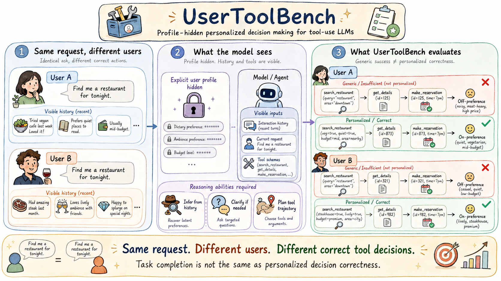
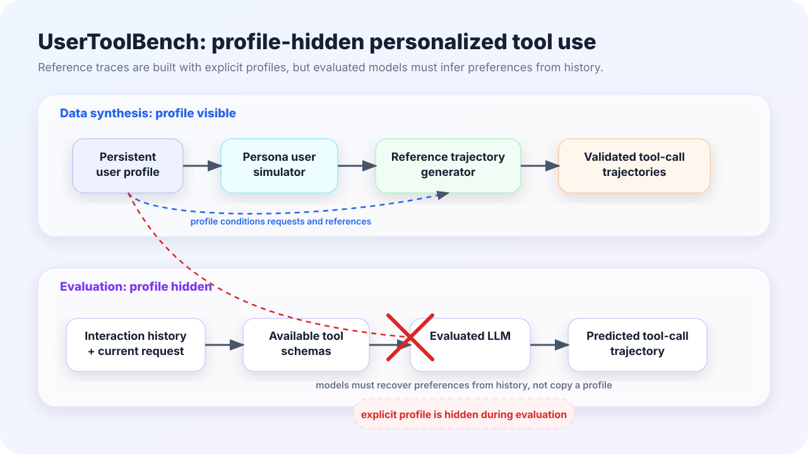
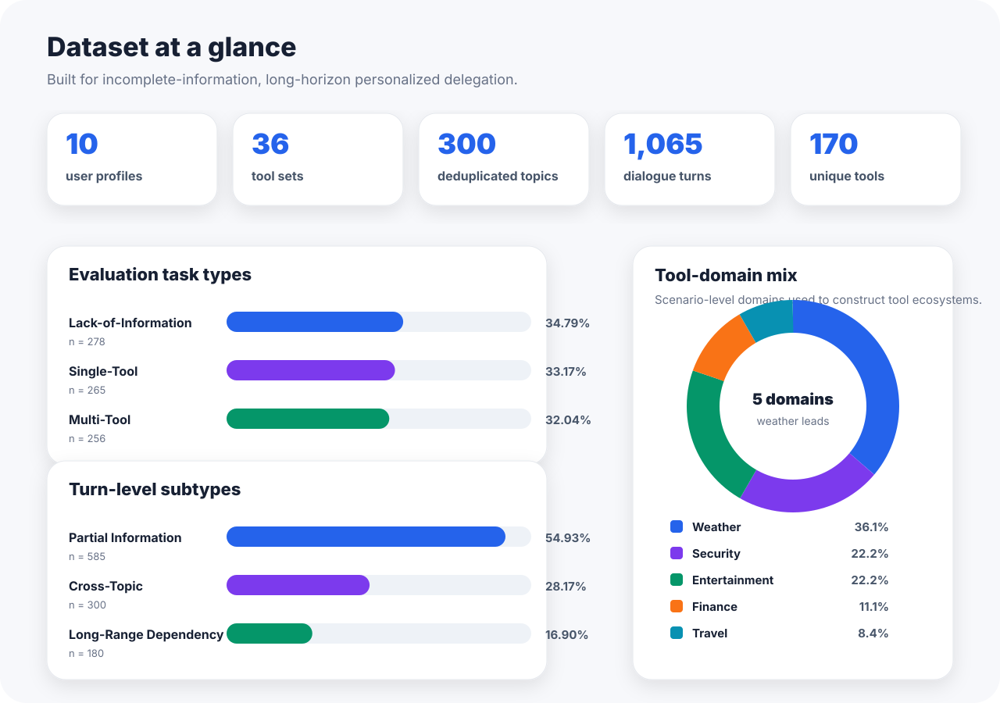
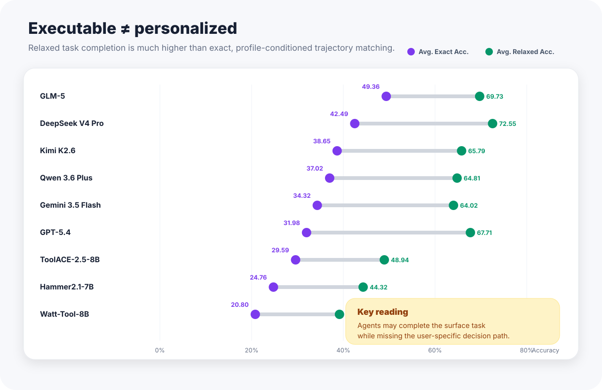
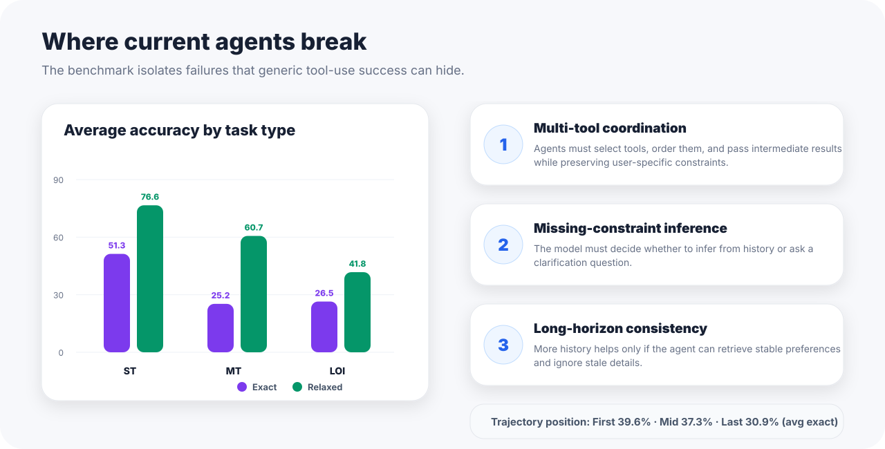

<div align="center">

# UserToolBench

### A User-Profile-Hidden Benchmark for Personalized Decision Making in Tool-Use LLMs

**Can a tool-use LLM make the right decision for a particular user when the explicit profile is hidden?**

[🌐 Project Page](https://xxy212.github.io/UserToolBench/) ·
[🤗 Dataset](https://huggingface.co/datasets/XuexiongYin/UserToolBench) ·
[💻 Code](./utb) ·
[📄 Paper](https://arxiv.org/abs/2608.10042)

</div>
<p align="center">
  
</p>


## Overview

**UserToolBench** evaluates personalized delegation in tool-use large language models. Reference trajectories are constructed with access to persistent user profiles, while evaluated models receive only the interaction history, current request, and available tool schemas. A successful model must infer relevant preferences, decide whether clarification is necessary, and produce an executable user-aligned tool-call trajectory.

Unlike response-level personalization benchmarks, UserToolBench measures personalization through **tool selection, argument values, clarification behavior, and multi-step execution plans**.

> **Status:** Anonymous manuscript under review at **EMNLP 2026**. The current repository releases the core generation and evaluation code. Sanitized benchmark artifacts will be released separately.


<p align="center">
  
</p>

## Benchmark at a glance

| Component | Scale |
|---|---:|
| Persistent user profiles | **10** |
| Scenario-level tool sets | **36** |
| Dialogue turns | **1,065** |
| Unique tools | **170** |
| Deduplicated topics | **300** |
| Evaluated tool-use LLMs | **9** |

UserToolBench covers three evaluation settings:

- **Lack of information:** infer a recoverable constraint from history or ask for clarification when it is genuinely missing.
- **Single tool:** select the correct tool and fill decision-relevant arguments.
- **Multiple tools:** coordinate ordered or parallel tool calls while preserving user-specific constraints.

## Why UserToolBench?

| Existing evaluation focus | UserToolBench adds |
|---|---|
| Profile recall or stylistic adaptation | Executable personalized decisions |
| Fully specified tool-use requests | Incomplete requests grounded in history |
| One-shot API selection | Long-horizon multi-turn trajectories |
| Generic task completion | Profile-conditioned trajectory alignment |

<p align="center">
  
</p>

## Evaluation

We report two complementary metrics:

1. **Exact trajectory accuracy** requires the predicted tool sequence and all required decision-relevant arguments to match the profile-conditioned reference trajectory.
2. **Relaxed task completion accuracy** credits valid executable solutions when alternative tool orderings or plans are acceptable.

The distinction reveals whether a model merely completes the surface task or actually follows the decision path appropriate for the represented user.

<p align="center">
  
</p>

## Key findings

- The best evaluated model reaches only **49.36% average exact trajectory accuracy**.
- Multi-tool tasks are a major bottleneck: average exact accuracy drops from **51.30%** on single-tool tasks to **25.24%** on multi-tool tasks.
- Executable completion can hide personalization failures. For example, one evaluated model reaches **72.55% relaxed accuracy** but only **42.49% exact accuracy**.
- Longer interaction histories do not consistently improve performance; models must retrieve stable preferences while filtering stale or incidental context.

<p align="center">
  
</p>

## Code release

The implementation is under [`utb/`](./utb):

```text
utb/
├── generation/        # multi-role personalized trajectory synthesis
├── evaluation/        # tool-call prediction and benchmark scoring
├── data_processing/   # persona preprocessing utilities
└── README.md          # detailed environment and command reference
```

### Installation

```bash
git clone https://github.com/xxy212/UserToolBench.git
cd UserToolBench/utb
python -m venv .venv
source .venv/bin/activate
pip install openai python-dotenv tqdm
```

### Generate personalized trajectories

```bash
cd generation
cp ../.env.example .env
python personalized_generate.py \
  --persona-limit 10 \
  --min-user-turns 45 \
  --max-user-turns 55
```

### Evaluate a model

```bash
cd evaluation
cp ../.env.example .env
python wtb/openfunctions_evaluation.py \
  --model deepseek-chat \
  --num-threads 8 \
  --data-dir ./data \
  --result-dir ./result

python -m wtb.eval_runner \
  --model deepseek-chat \
  --data-dir ./data \
  --result-dir ./result \
  --score-dir ./score
```

See [`utb/README.md`](./utb/README.md) for the complete generation, evaluation, and statistics workflow.

## Responsible use

The benchmark is designed for non-commercial research and educational evaluation of personalized tool-use systems. Raw interaction traces are not distributed. Released benchmark artifacts should contain only privacy-sanitized and abstracted profiles, interaction contexts, tool schemas, and reference trajectories. Do not attempt to re-identify individuals or deploy benchmark-trained systems for autonomous high-stakes decisions.

## Citation

The manuscript is currently anonymous and under review. Please use the following temporary citation until the final bibliographic record is available:

```bibtex
@misc{yin2026usertoolbenchuserprofilehiddenbenchmarkpersonalized,
      title={UserToolBench: A User-Profile-Hidden Benchmark for Personalized Decision Making in Tool-Use LLMs}, 
      author={Xuexiong Yin and Zechuan Chen and Yongsen Zheng and Yuxiang Zhang and Jingyuan Yang and Bin Wang and Yubin Wang and Keze Wang},
      year={2026},
      eprint={2608.10042},
      archivePrefix={arXiv},
      primaryClass={cs.LG},
      url={https://arxiv.org/abs/2608.10042}, 
}
```

## Acknowledgment

Questions, reproducibility reports, and release requests are welcome through [GitHub Issues](https://github.com/xxy212/UserToolBench/issues).
